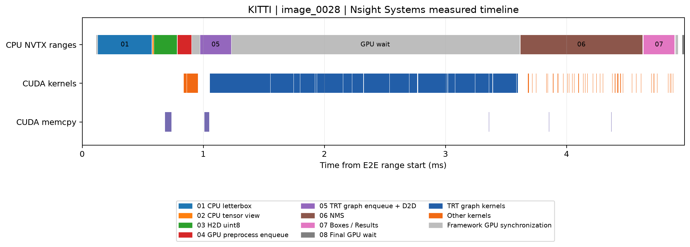
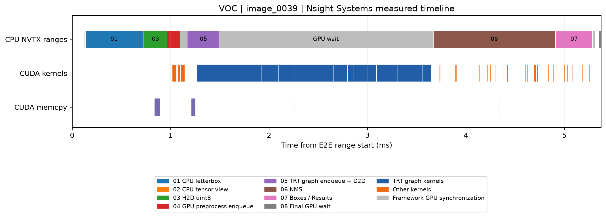

# TensorRT profiling: KITTI / VOC YOLOv8n FP32

Batch=1, imgsz=640, conf=0.25, IoU=0.70; 30 warmup predictions, 100 measured images.
Preloaded BGR input → CPU letterbox → H2D uint8 → GPU layout/cast/normalization → D2D + TensorRT CUDA Graph → NMS → box scaling/Results → final synchronization.
Disk I/O, decoding, initialization and exporting detections to CPU are excluded.

## Synchronized diagnostic decomposition

Stage synchronization changes scheduling. Means are additive; individual stage P95 values are not.

| Stage | KITTI mean (ms) | VOC mean (ms) |
|---|---:|---:|
| 01_CPU_letterbox | 0.4775 | 0.6006 |
| 02_CPU_tensor_view | 0.0113 | 0.0133 |
| 03_H2D_uint8 | 0.2193 | 0.2413 |
| 04_GPU_layout_cast_normalize | 0.1482 | 0.1676 |
| 05_TensorRT_backend_D2D_and_graph | 2.2826 | 2.2480 |
| 06_NMS | 0.7822 | 1.0281 |
| 07_scale_boxes_and_Results | 0.2028 | 0.2987 |
| 08_final_GPU_wait | 0.0124 | 0.0152 |
| 09_framework_and_instrumentation_overhead | 0.2465 | 0.2824 |

## TensorRT layer hotspots

Original engines, separate execution context with CUDA Graph captured with IProfiler enabled. 100 replays of one fixed representative input. Layer CUDA events add significant overhead; these values rank fused layers and cannot replace uninstrumented baseline latency.

### KITTI: 227 fused layers

| Rank | Layer | Mean (ms) | P95 (ms) | Share (%) |
|---:|---|---:|---:|---:|
| 1 | /model.22/cv2.0/cv2.0.0/conv/Conv \|\| /model.22/cv3.0/cv3.0.0/conv/Conv | 0.0727 | 0.0932 | 2.06 |
| 2 | /model.7/conv/Conv | 0.0617 | 0.0810 | 1.75 |
| 3 | /model.22/cv2.0/cv2.0.1/conv/Conv | 0.0592 | 0.0768 | 1.68 |
| 4 | /model.22/cv2.1/cv2.1.0/conv/Conv \|\| /model.22/cv3.1/cv3.1.0/conv/Conv | 0.0589 | 0.0799 | 1.67 |
| 5 | /model.1/conv/Conv | 0.0583 | 0.0717 | 1.65 |
| 6 | __myl_MoveNegExpAddDivMul_myl5_0 | 0.0563 | 0.0563 | 1.60 |
| 7 | /model.22/cv2.2/cv2.2.0/conv/Conv \|\| /model.22/cv3.2/cv3.2.0/conv/Conv | 0.0558 | 0.0737 | 1.58 |
| 8 | /model.22/cv3.0/cv3.0.1/conv/Conv | 0.0555 | 0.0717 | 1.57 |
| 9 | /model.19/conv/Conv | 0.0530 | 0.0707 | 1.50 |
| 10 | /model.0/conv/Conv | 0.0529 | 0.0543 | 1.50 |

### VOC: 242 fused layers

| Rank | Layer | Mean (ms) | P95 (ms) | Share (%) |
|---:|---|---:|---:|---:|
| 1 | /model.19/conv/Conv | 0.0823 | 0.1015 | 2.35 |
| 2 | /model.22/cv2.0/cv2.0.0/conv/Conv \|\| /model.22/cv3.0/cv3.0.0/conv/Conv | 0.0717 | 0.0840 | 2.05 |
| 3 | /model.22/cv2.0/cv2.0.1/conv/Conv | 0.0607 | 0.0829 | 1.73 |
| 4 | /model.7/conv/Conv | 0.0587 | 0.0707 | 1.68 |
| 5 | /model.22/cv2.1/cv2.1.0/conv/Conv \|\| /model.22/cv3.1/cv3.1.0/conv/Conv | 0.0584 | 0.0707 | 1.67 |
| 6 | /model.1/conv/Conv | 0.0573 | 0.0645 | 1.64 |
| 7 | /model.21/cv2/conv/Conv | 0.0568 | 0.0799 | 1.62 |
| 8 | __myl_MoveNegExpAddDivMul_myl5_0 | 0.0563 | 0.0563 | 1.61 |
| 9 | /model.22/cv2.2/cv2.2.0/conv/Conv \|\| /model.22/cv3.2/cv3.2.0/conv/Conv | 0.0552 | 0.0656 | 1.58 |
| 10 | /model.22/cv3.0/cv3.0.1/conv/Conv | 0.0542 | 0.0635 | 1.55 |

## Nsight Systems results

Captured actual deployment CUDA Graph path, node-level CUDA trace + NVTX, cudaProfilerApi capture after warmup. CPU stage NVTX durations are launch/host durations, not GPU execution durations. Gray Framework_GPU_sync ranges annotate the existing Ultralytics Profile boundary waits. GPU projected ranges measure first-to-last GPU operation span, including gaps; they can overlap and must not be added. Kernel summary groups identical kernel names across layers.

### KITTI

Trace E2E mean 5.064 ms; median 4.984 ms; P95 6.111 ms (Nsight overhead included).

| GPU projected range | Mean span (ms) | Median span (ms) |
|---|---:|---:|
| :05_TensorRT_backend_D2D_and_graph | 2.3158 | 2.1701 |
| :06_NMS | 1.1276 | 0.9356 |
| :07_scale_boxes_and_Results | 0.2692 | 0.1982 |
| :04_GPU_layout_cast_normalize | 0.1286 | 0.1154 |
| :03_H2D_uint8 | 0.0545 | 0.0543 |

### VOC

Trace E2E mean 5.419 ms; median 5.363 ms; P95 6.274 ms (Nsight overhead included).

| GPU projected range | Mean span (ms) | Median span (ms) |
|---|---:|---:|
| :05_TensorRT_backend_D2D_and_graph | 2.3122 | 2.4158 |
| :06_NMS | 1.2844 | 1.1674 |
| :07_scale_boxes_and_Results | 0.3287 | 0.2704 |
| :04_GPU_layout_cast_normalize | 0.1420 | 0.1291 |
| :03_H2D_uint8 | 0.0560 | 0.0556 |

## Open in Nsight Systems

Open `kitti_timeline.nsys-rep` and `voc_timeline.nsys-rep` in Nsight Systems. Expand CUDA HW / Streams and the CPU thread NVTX rows. Search `E2E/`, `05_TensorRT`, and `06_NMS`; select a steady-state image and zoom to the range. Follow CUDA API correlation to graph nodes and inspect kernel/copy durations.

Engines were built with LAYER_NAMES_ONLY. Layer ranking works, but detailed tensor shapes/tactics are not embedded; enabling DETAILED requires building a new engine.

Official references: [Nsight Systems User Guide](https://docs.nvidia.com/nsight-systems/UserGuide/index.html), [TensorRT IExecutionContext](https://docs.nvidia.com/deeplearning/tensorrt/latest/_static/python-api/infer/Core/ExecutionContext.html).